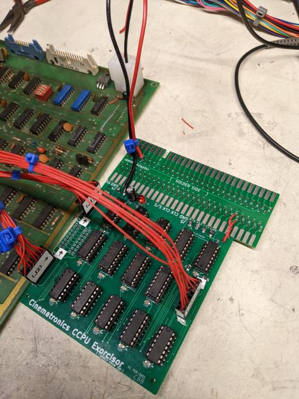
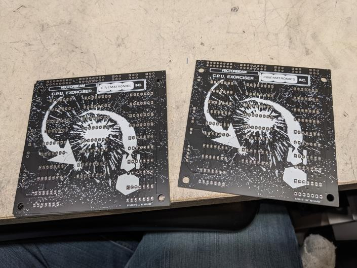

# Cinematronics Exorcisor

A reproduction Cinematronics Exorcisor, used for signature analysis on CCPU's
You're going to need a signature analyzer in addition to this PCB to be able to use this.
Maybe one day I'll make 

**BILL OF MATERIALS** :\
--coming soon!-- 

**TESTING STATUS:**

V1 works! Tested and working.
V2 is the same, but with better locations for connectors.
Use V2. it looks best when you order a black PCB.
I fit this in 100x100mm so that it's cheap to get made.
Got some rad silkscreening from Space War's side art on the back, which is why it looks best when you order a black PCB.
(I haven't built one of the v2, but it's functionially identical so there's no reason it shouldn't work)

**INSTALLATION INSTRUCTIONS:**

I fit this in 100x100mm so that it's cheap to get made.
Got some rad silkscreening from Space War's side art on the back, it looks best when you order a black PCB.
(but the complexity makes it take a little more time to load in viewers, sorry!)
Assembly of the PCB is pretty straightforward.
Chip types are labeled on the PCB's silkscreening.
All the connectors are pin headers @ a pitch of 0.1" / 2.54mm

Onto the cabling. 
D8 and U14 both use the same kind of cable: a 16 (8x2) pin ribbon cable from the header on the PCB to a male DIP insert.
N2, R2, and T2 share the same kind of cable: a 6 (3x2) pin ribbon cable that connects to a 16 pin DIP clip.

For the D8/U14, you can find a 16 pin ribbon cable already assembled, and use the "ribbon adapter" gerbers I provided.
For the N2, R2, and T2, you can crimp 5 wires in a connector, and wire them to pin 4, 12, 9, 7, and 8 of the DIP clip according to the diagram.
For some reason the ribbon cable assemblies and DIP clips are cheaper on amazon.

